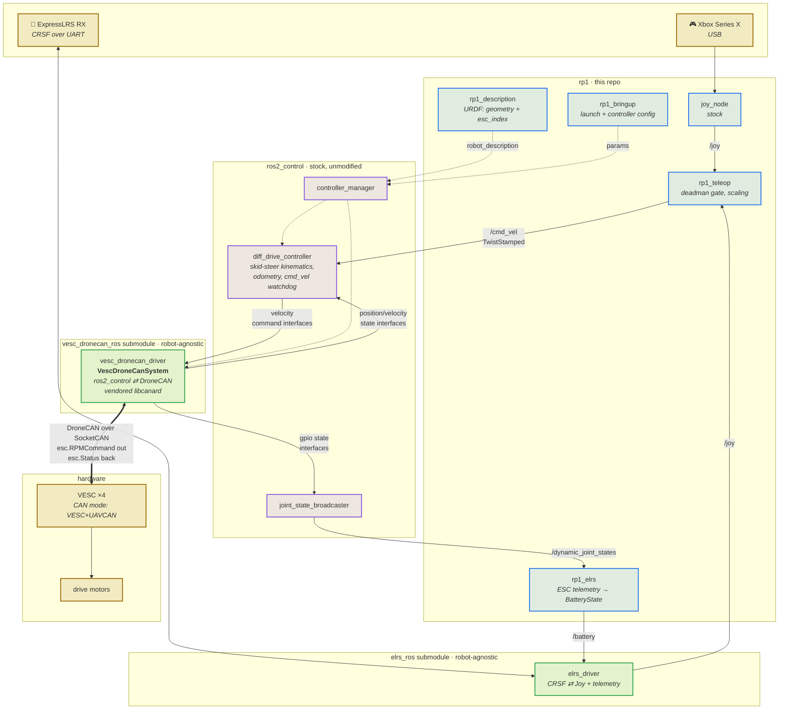

# rp1 — Agricultural Robot

4-wheel agricultural robot. Each wheel is driven by a VESC-based motor controller and (in the
full build) sits on a continuous-rotation (360°) steering joint — a swerve-drive base. This
repo currently targets the **MVP: the 4 drive wheels only, skid-steer, no steering joints yet**.

## System graph

VESC firmware has a built-in UAVCAN/DroneCAN CAN mode, so there is **no separate bridge MCU**:
the PC talks DroneCAN directly to the 4 VESCs over a single CAN bus.

The colour bands are the thing to read first — **most of the stack is not rp1 code**. rp1 owns
the intent layer and the robot's own description; the kinematics are stock `ros2_controllers`,
and the DroneCAN transport is a robot-agnostic component in a sibling repo.



Two interchangeable RC inputs feed the same `/joy`: the Xbox pad via `joy_node`, or an
ExpressLRS radio via `elrs_driver`. Pick one per bringup (`rp1_mvp.launch.py` vs
`rp1_mvp_elrs.launch.py`) — don't run both, two publishers on `/joy` would fight.

DroneCAN is the runtime transport from the PC to the robot. VESC USB (VESC Tool) is used only
for one-off per-motor configuration (CAN mode, node ID, `esc_index`, FOC tuning), never in the
runtime control path. See `docs/can_id_map.md` and `docs/wiring.md`.

## Control hierarchy

Movement commands flow through the same layers whether they come from a human or, later, an
autonomy stack — everything below `/cmd_vel` doesn't care which. Today there's no steering, only
the 4 drive wheels; the steering row is the planned extension.

| Layer | What it decides | Who | Interface |
|-------|------------------|-----|-----------|
| Input | "go this fast, turn this fast" | `rp1_teleop` | `sensor_msgs/Joy` → `geometry_msgs/TwistStamped` on `/cmd_vel` |
| Kinematics | Robot-frame velocity → per-actuator setpoints | `diff_drive_controller` (stock) | `/cmd_vel` → per-wheel velocity command interfaces |
| Transport | Setpoints → the wire | `vesc_dronecan_driver` (sibling submodule) | velocity interface → DroneCAN `esc.RPMCommand` |
| Actuator | Actually spins/turns | VESC (drive), future steering actuator | closed-loop speed PID / (future) joint position |

**Drive wheels (implemented).** `diff_drive_controller` runs the skid-steer kinematics and
odometry; the wheels are **velocity-controlled**, so there's no target angle to hold and no
position loop at this layer. `esc.Status` telemetry (rpm/voltage/current) is exactly that —
telemetry, not something the controller closes a loop on. `esc.Status` carries no position, so
the wheel angle in `/joint_states` is integrated from reported speed, which is why odometry runs
on velocity (`position_feedback: false`) rather than integrated position.

**Steering joints (planned, see `docs/can_id_map.md`).** The kinematics become full swerve IK —
each wheel an independent (speed, angle) pair from the same `/cmd_vel`. Steering is
**position-controlled** and continuous/360°, so angle wrap has to be handled explicitly. It rides
the same `vesc_dronecan_driver` component via `uavcan.equipment.actuator.ArrayCommand`/`Status`,
a parallel path at the same layer rather than a new layer. Note that **no stock ros2_controllers
controller models 4 independently-steered 360° modules**, so that one has to be written.

## Repo layout

- `ros2_ws/` — ROS2 colcon workspace.
  - `rp1_description` — the URDFs: geometry, `esc_index` assignments, hardware params.
  - `rp1_teleop` — Joy → `/cmd_vel`, deadman-gated.
  - `rp1_elrs` — rp1's ELRS glue: ESC telemetry → `BatteryState` for the handset.
  - `rp1_bringup` — launch files + controller/robot params tying it all together.
  - `rp1_msgs` — `WheelCommand`/`WheelFeedback`/`SteeringCommand`/`SteeringFeedback`. Used by
    `rp1_sim` **only**; the drive path carries data over ros2_control interfaces, not topics.
  - `rp1_sim` — pure-ROS2 swerve simulator, no CAN. (For the MVP skid-steer case use
    `use_mock:=true` instead.)
- `docs/` — CAN id map, wiring notes, mechanical request.
- `simulation/` — virtual-CAN DroneCAN stand-ins for the VESCs, for exercising the **real**
  hardware component with no hardware. See `simulation/README.md`.

**Not in this repo** — two robot-agnostic packages were extracted so other robots can use them,
and live as sibling submodules of the `robotpicks` meta repo:

| Package | Repo | What it is |
|---------|------|------------|
| `vesc_dronecan_driver` | `vesc_dronecan_ros` | ros2_control ⇄ DroneCAN for VESCs, vendored libcanard |
| `elrs_driver` | `elrs_ros` | CRSF receiver driver: RC → `/joy`, telemetry back |

## Build

The workspace spans three repos, so a bare `colcon build` inside `ros2_ws` is **not** enough —
it would miss both sibling packages. Build from the meta repo:

```bash
./robotpicks.sh build rp1
```

or point colcon at all three trees yourself:

```bash
source /opt/ros/$ROS_DISTRO/setup.bash
cd ros2_ws
colcon build --symlink-install --base-paths src ../../elrs_ros ../../vesc_dronecan_ros
source install/setup.bash
```

## Run

```bash
ros2 launch rp1_bringup rp1_mvp.launch.py              # real hardware, Xbox pad
ros2 launch rp1_bringup rp1_mvp_elrs.launch.py         # real hardware, ExpressLRS radio
```

### Without hardware

Whole stack, no CAN — swaps in ros2_control's mock hardware:

```bash
ros2 launch rp1_bringup rp1_mvp.launch.py use_mock:=true
ros2 launch rp1_bringup rp1_mvp.launch.py use_mock:=true rviz:=true   # + odometry/TF in rviz
ros2 launch rp1_bringup rp1_mvp.launch.py use_mock:=true teleop:=false rqt_steering:=true
    # mouse-driven slider GUI instead of the Xbox pad -- teleop:=false is required, both
    # publish to the same /cmd_vel topic
```

Real DroneCAN framing against a virtual bus (this is what CI runs):

```bash
./robotpicks.sh smoke dronecan
```

`use_mock:=true` stops at the hardware boundary — it exercises the controller stack but nothing
below `vesc_dronecan_driver`. The vcan route covers that last layer. See `simulation/README.md`.

## Status

MVP scaffold in progress — see `docs/wiring.md` for the bring-up sequence (configure each
VESC's UAVCAN settings before wiring it into the shared bus; wheels off the ground before
driving on the ground).

## Roadmap

- **4 steering joints** (swerve) — needs a swerve controller (nothing stock fits), encoders on
  the steering VESCs, and the firmware's actuator support. See `docs/can_id_map.md`.
- **OpenIPC-based IP camera** for vision/FPV.
